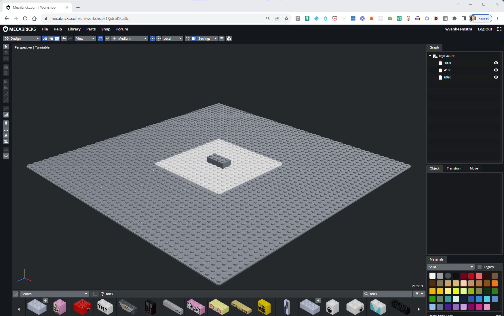

# Lego

Based on "L3DI.js - Lego 3D Instruction" at https://l3di.netlify.app/

Based on "Floor Planner" at https://www.floorplanner.com who created "ColladaLoader" at https://gist.github.com/funnylookinhat/5155628

Lego-Azure model kept at https://www.mecabricks.com/en/workshop/1XjdrbKKa8b

Construction explanation on YouTube as "L3DI_Tutorial" at https://www.youtube.com/watch?v=zkbWvpo6TAM

**RECOMMENDED**: An awesome demo by Ikaz Ik on YouTube as ""Simple Adjustment" - LEGO CGI Animation -" at https://www.youtube.com/watch?v=5kAHiDYYpMo

